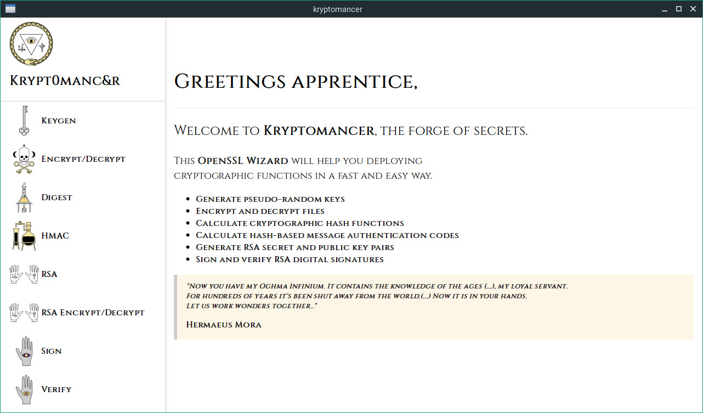

# kryptomancer
[](https://cirrus-ci.com/github/murlokito/kryptomancer)

An OpenSSL wizard (GUI), made for a University Class, open sourced for the greater good.

## Getting Started

These instructions will get you a copy of the project up and running on your local machine for various purposes.

### Prerequisites

In order to be able to install and run the application you will need the following programs in your machine.

```
Docker >18 (optional)
Python >3.7
pip >18.1
pywebview >2.2.1 (optional)
Make >4.2.1 (optional)
```

`pywebview` is a python package, if you decide using it, `pip install pywebview` should be enough.

### Installing

You can install and run the application in several ways.

#### Docker

Go to the root folder of the repository and, considering you have `Docker` installed on your machine, execute the following commands:


```
#The following command will build the app from an alpine image to keep it small
make build_app

#The next command will simply run the container
make start_backend
```
After that you have two options, you can open your browser and connect to the app there at `127.0.0.1:5000` or run it natively in your machine (Qt, GTK, Cocoa, WinForms)

Note: to be able to run the app natively you will need the python `pywebview` package installed in your machine.
```
python3 kryptomancer.py &
```

#### Just py+flask things

Go to the root folder of the repository and, considering you have `python3` and `pip` installed on your machine, execute the following commands:


```
pip install -r Requirements.txt & \
python3 kryptomancer.py -env threaded &

```
After that you have two options, you can open your browser and connect to the app there at `127.0.0.1:5000` or run it natively in your machine (Qt, GTK, Cocoa, WinForms)

Note: to be able to run the app natively you will need the python `pywebview` package installed in your machine.
```
python3 kryptomancer.py &
```


## Built With

* [Flask](http://flask.pocoo.org/) - The web framework used
* [pywebview](https://pywebview.flowrl.com) - A cross-platform wrapper for web apps to display its content in a native window

## Contributors

* **Hugo Carvalho** - *Maintainer* - [murlokito](https://github.com/murlokito)
* **António Matos** - *Maintainer* - [ajsmatos](https://github.com/ajsmatos)
* **João Silva** - *Initial work* - [JoaoSilva](https://github.com/JoaoSilva)
* **Guilherme Poeta** - *Initial work* - [P0ETA](https://github.com/P0ETA)

* **Pedro Marreiros** - *Testing Monkey* - [sombrito](https://github.com/sombrito)

See also the list of [contributors](https://github.com/your/project/contributors) who participated in this project.

## License

This project is licensed under the MIT License - see the [LICENSE.md](LICENSE.md) file for details

## Acknowledgments

* Prof. Pedro Inácio for the project assignment
* Pedro Marreiros for being our testing monkey
* Hat tip to anyone whose code samples were used in fixing our problems
* Inspiration
